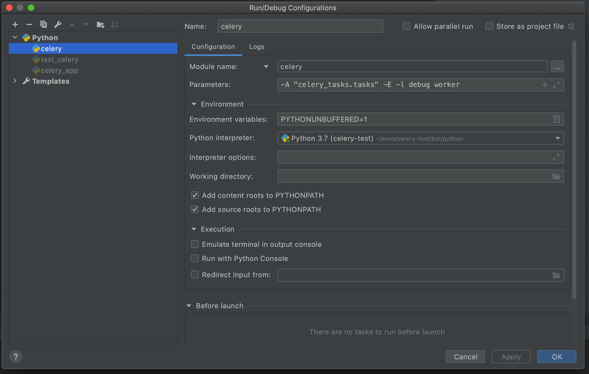
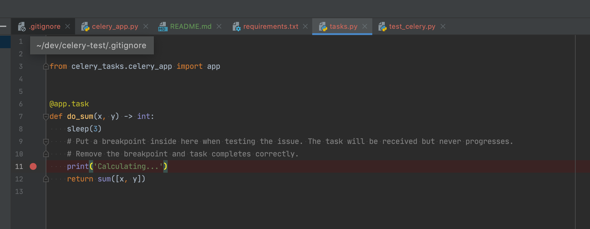
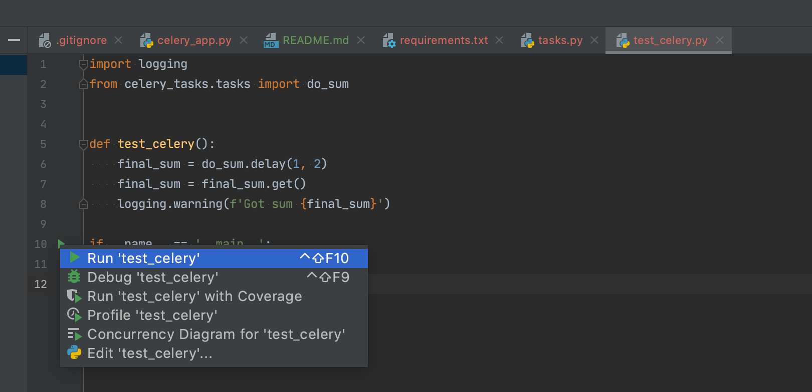
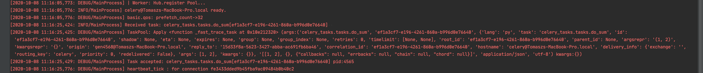
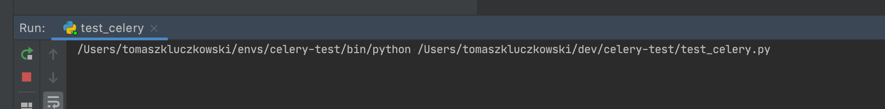

ISSUE: PY-44266

RE: https://youtrack.jetbrains.com/issue/PY-44266

Steps to reproduce:

- this issue occurs when using rabbitmq broker/backend. I did not test with any other broker.
- please install rabbitmq and have it accessible at localhost:5672
- see `celery_app.py` for the configuration of the celery object.

- create virtualenv for the project

- pip install -r requirements.txt 

- Create celery configuration:

- Start it in **DEBUG** mode.

- put a breakpoint in the task we want to debug

- run the code that will start the test task in run mode - `test_celery`

- check the console log of the celery configuration - the task is received/accepted but does not progress/produce the result (hangs)

- the configuration `test_celery` that we started in run mode also hangs...

Hope this helps getting to the bottom of the problem!

If you remove the breakpoint all works fine even if celery configuration is started in debug mode.

Tom
